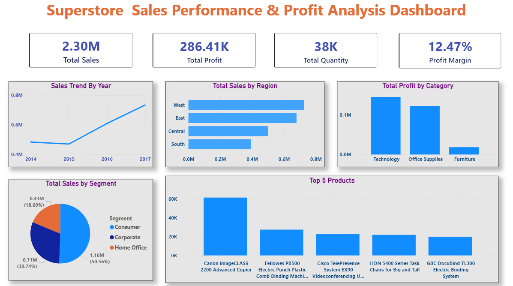
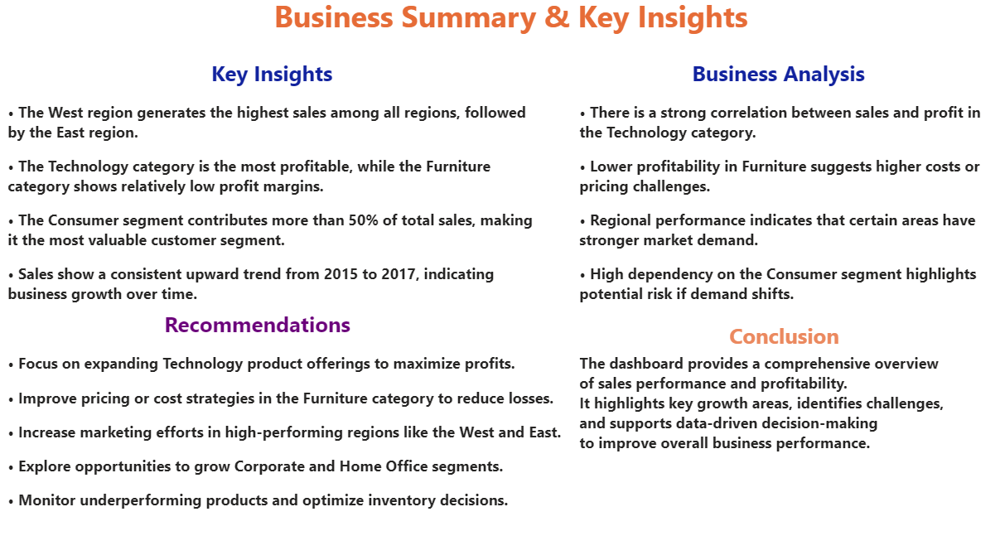

# 📊 Superstore Sales Performance Dashboard



## 📌 Overview

This project presents an interactive **Power BI dashboard** analyzing sales performance, profitability, and customer behavior using the Superstore dataset.

It demonstrates how raw data can be transformed into **actionable insights** through effective data visualization and storytelling.

---

## 🎯 Objectives

* Analyze overall sales and profit performance
* Identify top-performing regions and categories
* Understand customer segment contributions
* Track sales trends over time
* Highlight top-performing products

---

## 🛠️ Tools & Technologies

* Microsoft Power BI
* Power Query (Data Cleaning)
* DAX (Data Analysis Expressions)

---

## 📁 Dataset

* Superstore Sales Dataset

---

## 🧠 Key Insights

* West region generates the highest sales
* Technology category is the most profitable
* Furniture category shows lower profit margins
* Consumer segment contributes the majority of revenue
* Sales show consistent growth over time

---

## 📖 Storyboard / Summary



---

## 🚀 Business Recommendations

* Focus on expanding Technology category for higher profits
* Improve cost and pricing strategies in Furniture category
* Strengthen marketing in high-performing regions
* Explore growth opportunities in Corporate and Home Office segments

---

## 📂 Repository Structure

```
superstore-sales-dashboard/
│
├── Sample - Superstore.csv
├── Superstore_SalesAnalysis_Dashboard.pbix
├── PowerBI_Dashboard.png
├── StoryBoard.png
└── README.md
```

---

## 📌 Conclusion

This dashboard provides a clear view of business performance by combining data visualization with storytelling. It enables stakeholders to make informed, data-driven decisions.

---

## ⭐ Key Learning Outcomes

* Data cleaning using Power Query
* Creating measures using DAX
* Designing interactive dashboards
* Applying data storytelling techniques
